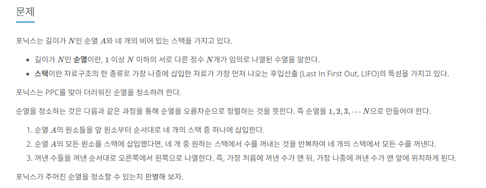
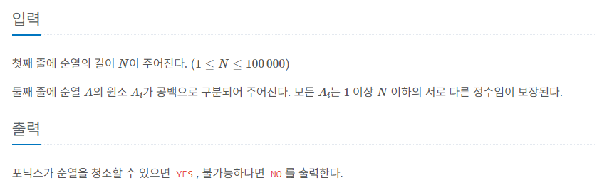

# 포스택

## BOJ / 백준

## 문제

https://www.acmicpc.net/problem/25556  [골드 5]



## 제한 사항



## 접근 방법

---

### 스택 활용

스택 배열 `Stack<Integer>[] stacks`를 사용하여 순열 정리 과정을 모방합니다.

### 스택 초기화

각 스택은 하나의 요소 0으로 초기화됩니다.

```java
Stack<Integer>[] stacks = new Stack[4];
for (int i = 0; i < 4; i++) {
    stacks[i] = new Stack<>();
    stacks[i].push(0);
}
```

### 적절한 스택 확인

현재 순열의 요소 `arr[i]`를 순회하면서, 현재 요소보다 작은 요소를 가진 스택을 찾습니다.

```java
for(int j = 0; j < 4; j++) {
    if(stacks[j].peek() < arr[i]) {
        stacks[j].push(arr[i]);
        flag = true;
        break;
    }
}
```

불가능한 경우 처리를 위해 `flag` 변수를 사용합니다.

```java
if(!flag) {
    System.out.println("NO");
    return;
}
```

아니면 
```java
System.out.println("YES");
```
출력

## 구현

```java
public static void main(String[] args) throws IOException {
        BufferedReader reader = new BufferedReader(new InputStreamReader(System.in));
        int n = Integer.parseInt(reader.readLine());
        int[] arr = Arrays.stream(reader.readLine().split(" ")).mapToInt(Integer::parseInt).toArray();

        Stack<Integer>[] stacks = new Stack[4];

        for (int i = 0; i < 4; i++) {
            stacks[i] = new Stack<>();
            stacks[i].push(0);
        }

        for(int i = 0; i < n; i++) {
            boolean flag = false;
            for(int j = 0; j < 4; j++) {
                if(stacks[j].peek() < arr[i]) {
                    stacks[j].push(arr[i]);
                    flag = true;
                    break;
                }
            }
            if(!flag) {
                System.out.println("NO");
                return;
            }
        }
        System.out.println("YES");
    }
```

## 시간 복잡도

순열의 각 요소를 스택에 삽입하고, 마지막에 스택에서 데이터를 추출하는 과정은 각각 O(n)의 시간이 소요됩니다. 따라서 전체 알고리즘의 시간 복잡도는 O(n)입니다.

## 공간 복잡도

스택 배열 `Stack<Integer>[] stacks`는 길이가 4인 배열이며, 각 스택은 순열의 길이에 비례하여 데이터를 저장합니다. 스택에 저장되는 총 데이터 양은 순열의 길이에 비례하므로 공간 복잡도는 O(n)입니다.

