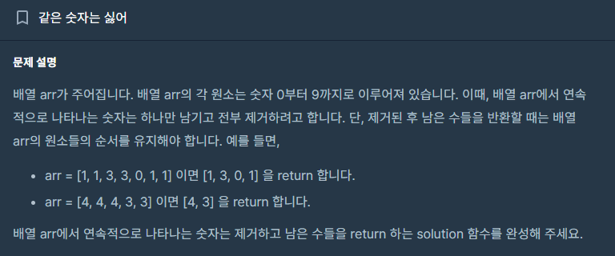
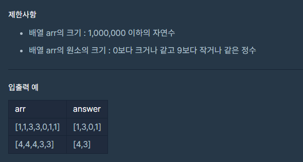

# 같은 숫자는 싫어

## Programmers / 프로그래머스

## 문제

https://school.programmers.co.kr/learn/courses/30/lessons/12906?language=java



## 제한 사항


## 풀이

---

1. 빈 스택을 초기화합니다.
2. 주어진 배열을 순회하면서 스택이 비어있지 않고, 스택의 맨 위 요소가 현재 요소와 같다면 스택에서 팝합니다 (연속된 중복 제거).
3. 그렇지 않으면 현재 요소를 스택에 추가합니다.
4. 최종적으로 스택에 남아 있는 요소들을 새로운 배열에 복사합니다.
5. 새로운 배열을 반환합니다.
## 구현

```java
public int[] solution(int[] arr) {
    Stack<Integer> stack = new Stack<>();

    for (int j : arr) {
        if (!stack.isEmpty() && stack.peek() == j) { // 스택 가장 높이 있는 데이터랑 현재 인덱스가 같을떄
            stack.pop(); //스택에 추가
        }
        stack.add(j); //아니면 pop
    }

    int[] answer = new int[stack.size()];
    for (int i = 0; i < stack.size(); i++) {
        answer[i] = stack.get(i);
    }

    return answer;
}
```

## 시간이랑 공간 복잡도

---

### 시간 : 

주어진 배열을 한 번 순회하면서 스택에 요소를 추가하거나 팝하는 과정이 이루어집니다. 따라서 시간 복잡도는 O(N)입니다. (N은 배열의 길이)

### 공간: 

스택을 사용하여 중복된 숫자를 제거하고 새로운 배열을 생성합니다. 따라서 추가적인 배열과 스택을 사용하므로 공간 복잡도는 O(N)입니다. (N은 배열의 길이)