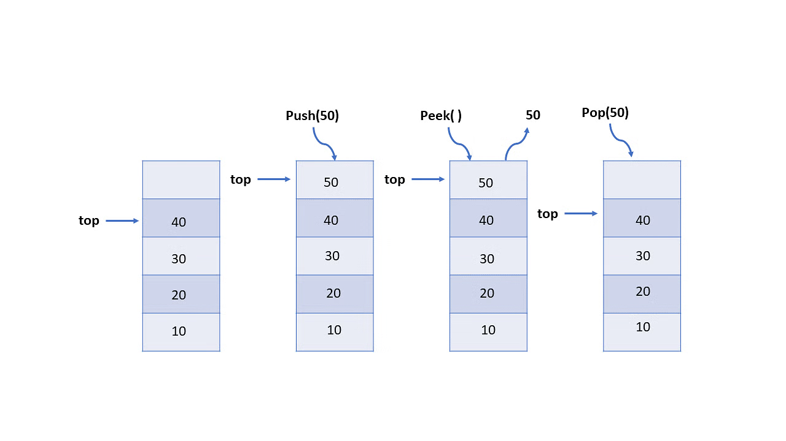

# 스택 (Stack) - Java

## 개요
스택(Stack)은 후입선출(LIFO, Last In First Out)의 원리를 따르는 자료구조입니다. 이는 가장 최근에 추가된 항목이 가장 먼저 제거되는 방식을 의미합니다. 스택은 자료의 입력과 출력이 한쪽에서만 이루어지는 구조를 가지고 있습니다.

## 기본 원리
- **Push**: 스택에 항목을 추가하는 작업. 항목은 스택의 맨 위에 추가됩니다.
- **Pop**: 스택에서 항목을 제거하는 작업. 항목은 스택의 맨 위에서 제거됩니다.

## 시간 복잡도
- **Push 및 Pop 연산**: O(1)의 상수 시간이 소요됩니다. 스택의 맨 위에서 항목을 추가하거나 제거하는 작업이므로 항상 일정한 시간이 소요됩니다.

## 공간 복잡도
- 스택은 선형 구조로 구현되어 고정된 크기를 가지며, 필요한 공간은 스택에 저장된 요소의 수에 비례합니다.

## 활용
스택은 다양한 컴퓨터 알고리즘 및 자료구조에서 사용됩니다. 주요 활용 예시는 다음과 같습니다:
- **재귀 함수 호출**: 함수 호출 정보를 스택에 저장하여 함수의 실행 상태를 추적합니다.
- **문자열 괄호 매칭**: 여는 괄호와 닫는 괄호의 매칭 여부를 확인하기 위해 스택을 사용합니다.
- **웹 브라우저 뒤로 가기**: 방문한 웹 페이지의 기록을 스택에 저장하여 뒤로 가기 기능을 구현합니다.

## 장점
- 간단하고 효율적인 자료구조로, 구현이 쉽습니다.
- Push 및 Pop 연산이 O(1)의 상수 시간이 소요되어 빠른 성능을 제공합니다.

## 단점
- 스택의 크기가 고정되어 있어 한계가 있습니다. 동적 크기 조절이 필요한 경우에는 다른 자료구조를 고려해야 합니다.
- 중간에 위치한 항목에 접근하기 어렵습니다.

## 참고 자료
- [Java Stack Documentation](https://docs.oracle.com/en/java/javase/15/docs/api/java.base/java/util/Stack.html)
- [스택(Stack) - 나무위키](https://namu.wiki/w/스택(Stack))
