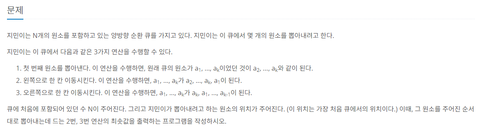
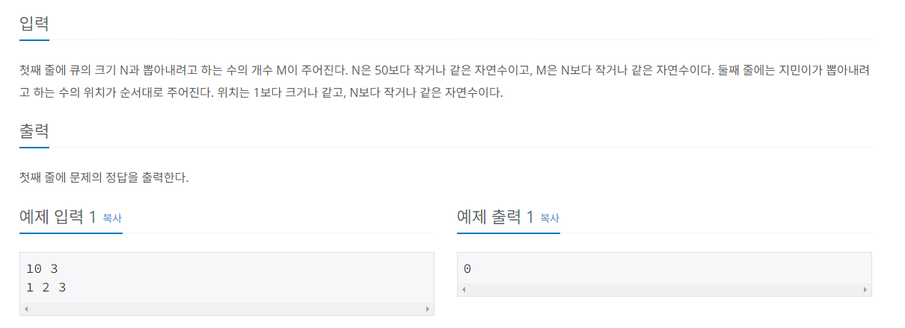

# 회전하는 큐

## BOJ / 백준

## 문제

https://www.acmicpc.net/problem/1021  [실버 3]



## 예제 입출력



## 접근 방법

---

### 큐 회전 알고리즘

- 주어진 큐에서 특정 순서로 원소를 뽑아내는 목적
- 각 원소를 뽑아내기 위해 필요한 회전 횟수를 계산
- 총합을 구해 회전 횟수의 총합을 출력

### 큐 초기화

초기에 큐를 1부터 N까지의 숫자로 초기화합니다.

```java
LinkedList<Integer> q = new LinkedList<>();
        for (int i = 1; i <= n; i++) {
        q.add(i);
        }
```

### 타겟 원소 위치 찾기 및 회전
```java
int target = Integer.parseInt(st.nextToken());
int index = q.indexOf(target);
int steps = index <= q.size() / 2 ? index : q.size() - index;

num += steps;

for (int j = 0; j < steps; j++) {
    if (index <= q.size() / 2) {
        q.addLast(q.removeFirst());
    } else {
        q.addFirst(q.removeLast());
    }
}

q.removeFirst();
```

## 구현

```java
package CodingTest.OnBoardingDay2.BOJ;

import java.io.BufferedReader;
import java.io.BufferedWriter;
import java.io.IOException;
import java.io.InputStreamReader;
import java.io.OutputStreamWriter;
import java.util.LinkedList;
import java.util.StringTokenizer;

class RotatingQueue {
    public static void main(String[] args) throws IOException {
        BufferedReader reader = new BufferedReader(new InputStreamReader(System.in));
        BufferedWriter writer = new BufferedWriter(new OutputStreamWriter(System.out));

        StringTokenizer st = new StringTokenizer(reader.readLine());
        int n = Integer.parseInt(st.nextToken());
        int m = Integer.parseInt(st.nextToken());

        int num = 0;
        LinkedList<Integer> q = new LinkedList<>();

        for (int i = 1; i <= n; i++) {
            q.add(i);
        }

        st = new StringTokenizer(reader.readLine());
        for (int i = 0; i < m; i++) {
            int target = Integer.parseInt(st.nextToken());
            int index = q.indexOf(target);

            int steps = index <= q.size() / 2 ? index : q.size() - index;

            num += steps;

            for (int j = 0; j < steps; j++) {
                if (index <= q.size() / 2) {
                    q.addLast(q.removeFirst());
                } else {
                    q.addFirst(q.removeLast());
                }
            }

            q.removeFirst();
        }

        writer.write(String.valueOf(num));
        reader.close();
        writer.flush();
        writer.close();
    }
}
```

## 시간 복잡도

각 순서대로 원소를 뽑아내는 과정은 각각 O(n)의 시간이 소요되므로 전체 알고리즘의 시간 복잡도는 O(n * m)입니다.

## 공간 복잡도

큐에는 1부터 N까지의 숫자가 들어가므로 큐의 공간 복잡도는 O(n)입니다.

