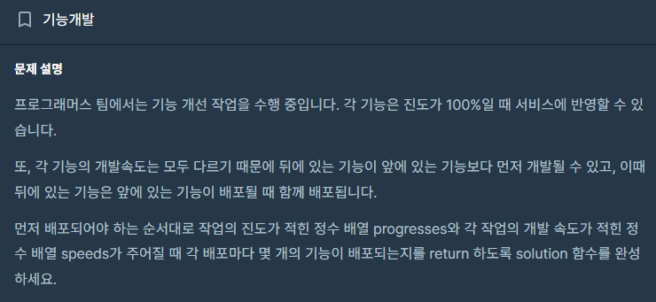
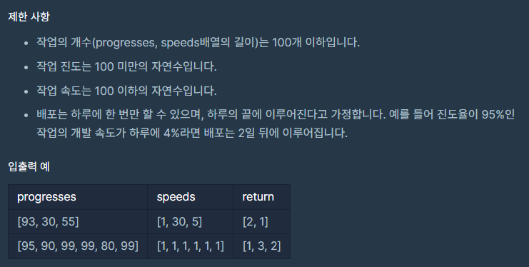

# 기능 개발

## Programmers / 프로그래머스

## 문제

https://school.programmers.co.kr/learn/courses/30/lessons/42586?language=java



## 제한 사항


## 풀이

---

1. 큐를 사용하여 각 작업에 대한 남은 날짜를 계산하고 큐에 저장합니다.
2. 큐에서 하나씩 꺼내면서 해당 날짜보다 작거나 같은 날짜들을 세어 하루에 배포될 작업 수를 구합니다.
3. 구한 수를 결과 리스트에 추가하고 반복합니다.
4. 최종적으로 결과 리스트를 반환합니다.
## 구현

```java
package CodingTest.OnBoardingDay2.Programmers;

import java.util.ArrayList;
import java.util.LinkedList;
import java.util.Queue;

public class FunctionalDevelopment {
    public static ArrayList<Integer> solution(int[] progresses, int[] speeds) {

        Queue<Integer> queue = new LinkedList<>();
        ArrayList<Integer> days = new ArrayList<>();

        for (int i = 0; i < progresses.length; i++) {
            int remainingProgress = 100 - progresses[i];
            int remainingDays = remainingProgress / speeds[i];

            if(remainingProgress % speeds[i] != 0) {
                remainingDays++;
            }
            queue.add(remainingDays);
        }

        while(!queue.isEmpty()) {
            int front_day = queue.peek();
            queue.poll();
            int count = 1;

            while(!queue.isEmpty() && front_day >= queue.peek()) {
                count++;
                queue.poll();
            }

            days.add(count);
        }
        return days;
    }
}
```

## 시간이랑 공간 복잡도

---
### 시간:
각 작업을 한 번씩 순회하면서 큐에 남은 날짜를 저장하고, 그 후에 결과를 구하는 과정이 이루어집니다. 따라서 시간 복잡도는 O(N)입니다. (N은 작업의 개수)

### 공간:

큐를 사용하여 각 작업에 대한 남은 날짜를 저장하므로 추가적인 큐와 결과 리스트를 사용하므로 공간 복잡도는 O(N)입니다. (N은 작업의 개수)