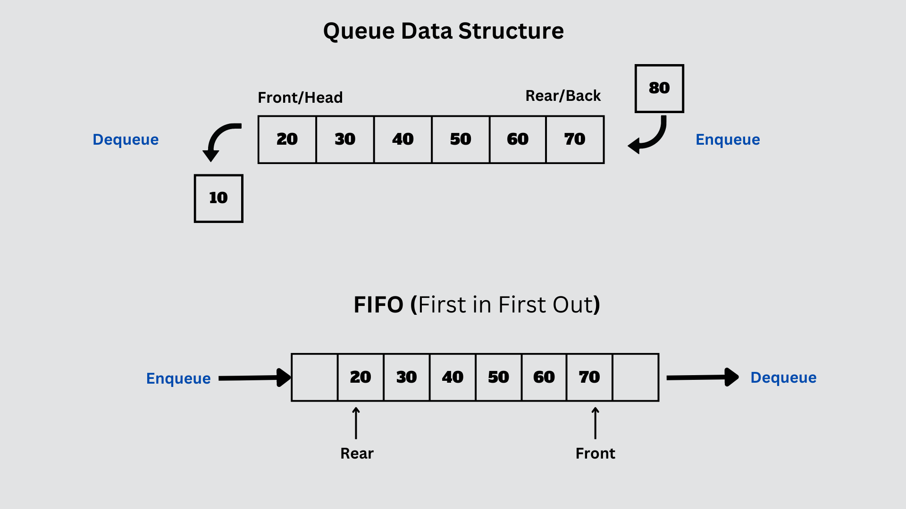

# Java 큐

## 개요

큐(Queue)는 선입선출(FIFO, First-In-First-Out) 원리를 따르는 선형 자료 구조입니다. Java에서는 `java.util.Queue` 인터페이스를 사용하여 큐를 구현하며, 다양한 구현체가 제공됩니다.

## 주요 특징

- **선입선출(FIFO):** 먼저 들어온 데이터가 먼저 나가는 특성을 가지고 있습니다.
- **삽입과 삭제 연산:** 주로 데이터의 삽입(`offer` 또는 `add`)과 삭제(`poll` 또는 `remove`) 연산이 사용됩니다.
- **Null 요소 허용:** 큐는 `null` 요소를 허용합니다.

## 주요 메서드

- **`offer(element)` 또는 `add(element)`:** 큐에 요소를 추가합니다. (시간 복잡도: O(1))
- **`poll()`:** 큐에서 맨 앞의 요소를 제거하고 반환합니다. 큐이 비어있을 경우 `null`을 반환합니다. (시간 복잡도: O(1))
- **`peek()`:** 큐의 맨 앞에 있는 요소를 반환하지만 큐에서 제거하지 않습니다. 큐이 비어있을 경우 `null`을 반환합니다. (시간 복잡도: O(1))
- **`isEmpty()`:** 큐가 비어있으면 `true`, 그렇지 않으면 `false`를 반환합니다. (시간 복잡도: O(1))

## 주요 인터페이스 및 클래스
- `java.util.Queue` 인터페이스
- `java.util.LinkedList`: 양방향 연결 리스트를 기반으로 하는 큐 구현 클래스
- `java.util.ArrayDeque`: 동적으로 크기가 조절되는 배열을 기반으로 하는 큐 구현 클래스
- `java.util.PriorityQueue`: 우선순위 큐를 구현한 클래스

## 활용 예제

큐는 다양한 문제에서 유용하게 사용됩니다. 예를 들어, 다음과 같은 경우에 활용될 수 있습니다:

- BFS(Breadth-First Search) 알고리즘에서 너비 우선 탐색을 구현할 때.
- 자료의 순서가 중요한 경우, 예를 들어 프린터 큐나 작업 대기열에서 작업 처리 순서 등.

