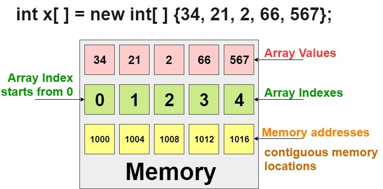

# 배열 (Array) Java

## 개요
배열은 기본 데이터 구조로, 각 요소가 색인 또는 키에 의해 식별되는 요소의 컬렉션을 저장합니다. 배열은 동일한 데이터 유형의 요소를 저장하기 위해 연속된 메모리 블록을 제공합니다. 그들은 간단하고 효율적이기 때문에 프로그래밍에서 널리 사용됩니다.

## 기본 원칙

1. **선언 및 초기화:**
    - Java에서 배열은 다음과 같은 구문을 사용하여 선언하고 초기화할 수 있습니다.
      ```java
      int[] numbers = {1, 2, 3, 4, 5};
      ```

2. **요소 접근:**
    - 배열 요소는 인덱스를 사용하여 액세스됩니다. 인덱스는 0부터 시작합니다.
      ```java
      int firstElement = numbers[0];
      ```

3. **배열 크기:**
    - 배열의 크기는 선언시 고정되며 동적으로 변경할 수 없습니다.

4. **동질한 요소:**
    - 배열은 동일한 데이터 유형의 요소를 보유하여 동질성을 보장합니다.



## 사용 사례

배열은 다양한 시나리오에서 사용됩니다.

- **정렬된 데이터 저장:**
  배열은 자연스러운 순서를 갖는 요소를 저장하기에 적합합니다. 예를 들어 숫자 또는 문자의 시퀀스입니다.

- **효율적인 임의 액세스:**
  배열에서 색인을 사용하여 요소에 액세스하는 것은 상수 시간 작업이므로 임의 액세스에 효율적입니다.

- **다른 데이터 구조 구현:**
  배열은 리스트, 스택, 큐 및 행렬과 같은 더 복잡한 데이터 구조를 구현하는 데 기초로 사용됩니다.

## 효율성과 복잡성

1. **시간 복잡성:**
    - 색인을 사용하여 요소에 액세스: O(1)
    - 끝에 요소 삽입 또는 삭제: O(1) (동적 배열의 경우, 정적 배열의 경우 요소를 이동해야 하므로 O(n))
    - 특정 요소 검색: O(n) (정렬되지 않은 배열의 경우)
    - 배열 정렬: O(n log n) (병합 정렬 또는 퀵소트와 같은 효율적인 정렬 알고리즘 사용)

2. **공간 복잡성:**
    - O(n) - 배열은 요소를 저장하기 위해 연속된 메모리 블록을 필요로 합니다.

## 일반적인 배열 메서드

### 1. **`length` 속성:**
- **설명:** 배열의 요소 수를 반환합니다.
- **예시:**
  ```java
  int size = numbers.length;
  ```

### 2. **정렬:**
- **설명:** 요소를 오름차순 또는 내림차순으로 정렬합니다.
- **예시:**
  ```java
  Arrays.sort(numbers);
  ```

### 3. **이진 검색:**
- **설명:** 정렬된 배열에서 특정 요소를 효율적으로 검색합니다.
- **예시:**
  ```java
  int index = Arrays.binarySearch(numbers, 3);
  ```

### 4. **복사:**
- **설명:** 요소를 하나의 배열에서 다른 배열로 복사합니다.
- **예시:**
  ```java
  int[] copy = Arrays.copyOf(numbers, numbers.length);
  ```

### 5. **채우기:**
- **설명:** 배열의 모든 요소를 특정 값으로 설정합니다.
- **예시:**
  ```java
  Arrays.fill(numbers, 0);
  ```

## 결론

배열은 다양하고 효율적인 데이터 구조로 다양한 응용 프로그램에서 사용됩니다. 배열의 원칙과 일반적인 메서드를 이해하는 것은 효과적인 프로그래밍과 알고리즘 설계에 중요합니다. 응용 프로그램의 특정 요구 사항에 기반하여 배열 작업의 시간 및 공간 복잡성을 고려하여 합리적인 선택을 할 수 있도록 유의해야 합니다.
