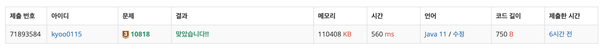

# 최소, 최대

## BOJ / 백준

## 문제

https://www.acmicpc.net/problem/10818  [브론즈 3]


## 제한 사항


## 접근 방법
이 문제는 주어진 숫자들 중에서 최솟값과 최댓값을 찾는 간단한 문제입니다. 
주어진 배열을 순회하면서 현재까지의 최솟값과 최댓값을 갱신하는 방식으로 해결할 수 있습니다. 
초기값으로 배열의 첫 번째 원소를 설정하고, 배열을 순회하면서 각 원소를 비교하여 최솟값과 최댓값을 업데이트합니다. 
최종적으로 찾은 최솟값과 최댓값을 출력하면 문제를 해결할 수 있습니다.
---
## 구현

```java
package CodingTest.OnBoardingDay3.BOJ;

import java.io.BufferedReader;
import java.io.IOException;
import java.io.InputStreamReader;
import java.util.Arrays;

public class MinMaxInteger {
    public static void main(String[] args) throws IOException {
        BufferedReader reader = new BufferedReader(new InputStreamReader(System.in));
        int n = Integer.parseInt(reader.readLine());
        int[] arr = Arrays.stream(reader.readLine().split(" ")).mapToInt(Integer::parseInt).toArray();

        int min = arr[0];
        int max = arr[0];

        for (int i = 0; i < n; i++) {
            if(min > arr[i]){
                min = arr[i];
            }

            if(max < arr[i]){
                max = arr[i];
            }
        }
        System.out.println(min + " " + max);
    }
}
```

## 시간 복잡도

이 코드의 시간 복잡도는 O(n)입니다. 배열의 모든 요소를 한 번씩만 확인하기 때문에 입력 크기에 선형으로 비례합니다.

## 공간 복잡도

이 코드의 공간 복잡도는 O(n)입니다. 입력된 배열의 크기에 따라 배열을 저장하기 위한 공간이 선형으로 증가합니다.

## 코드 인증


