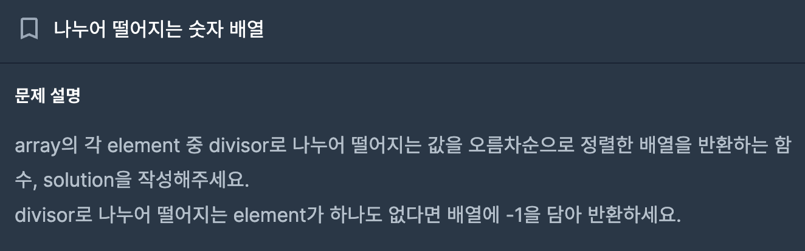
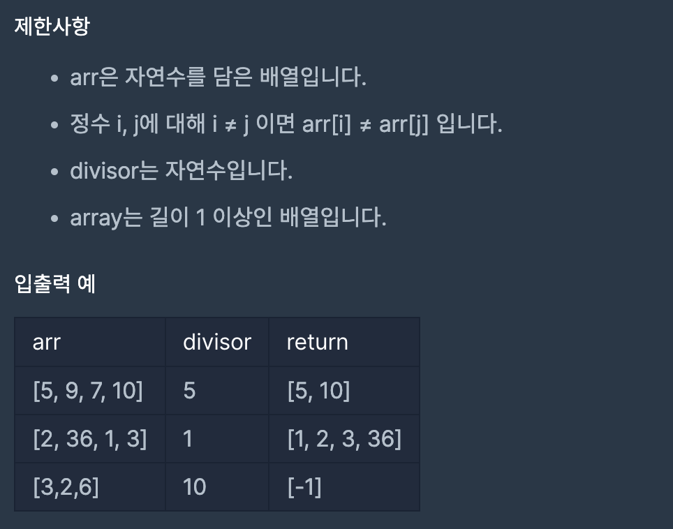

# 나누어 떨어지는 숫자 배열

## 프로그래머스

## 문제

https://school.programmers.co.kr/learn/courses/30/lessons/12910?language=java



## 제한 사항



## 접근 방법
- 배열을 순회하면서 나누어 떨어지는 원소의 개수를 센다.
- 나누어 떨어지는 원소가 하나도 없으면 [-1]을 반환한다.
- 나누어 떨어지는 원소의 개수를 기반으로 새로운 배열을 생성한다.
- 배열을 순회하면서 나누어 떨어지는 원소를 새로 생성한 배열에 추가한다.
- 새로 생성한 배열을 정렬한다.
- 정렬된 배열을 반환한다.
---
## 구현

```java
public static int[] solution(int[] arr, int divisor) {
    int[] answer;
    int count = 0;

    for (int j : arr) {
        if (j % divisor == 0) {
        count++;
        }
    }
    answer = new int[count];

    if(count == 0) {
        return new int[]{-1};
    }

    int answerIndex = 0;
    for (int i : arr) {
        if (i % divisor == 0) {
        answer[answerIndex++] = i;
        }
    }

    Arrays.sort(answer);
    return answer;
}
```

## 시간 복잡도

- 배열을 한 번 순회하여 나누어 떨어지는 원소의 개수를 세는 과정이 O(n)
- 나누어 떨어지는 원소가 없는 경우를 처리하고, 새로운 배열을 생성하고 정렬하는 과정도 O(nlogn) (정렬 알고리즘의 시간 복잡도)
- 따라서 총 시간 복잡도는 O(n + nlogn) = O(nlogn)

## 공간 복잡도

- count 변수는 추가적인 공간을 사용하지 않고, 단순히 나누어 떨어지는 원소의 개수를 세는 데 사용됨.
- answer 배열은 나누어 떨어지는 원소를 저장하기 위해 공간을 할당하는 데 사용됨. 최악의 경우 배열의 크기는 입력 배열의 크기와 동일하게 될 수 있음.
- 따라서 총 공간 복잡도는 O(n)이 될 수 있습니다.

## 코드 인증


