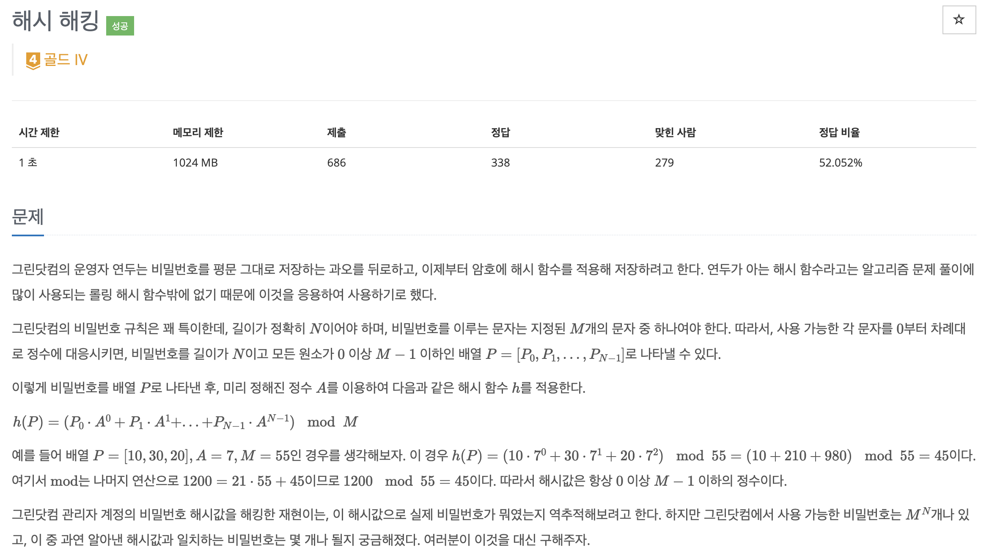
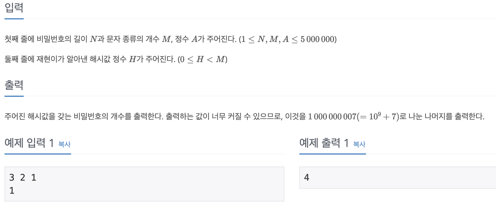
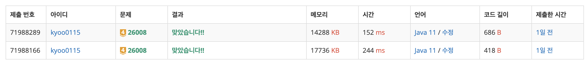

# 해시 해킹

## BOJ / 백준

## 문제

https://www.acmicpc.net/problem/26008  [골드 4]



## 예제 입출력



## 접근 방법

---

### 알고리즘

- 이 문제는 주어진 입력에 따라 해시 함수를 계산하는 것입니다. 주어진 입력은 n, m, a, h입니다. 이들은 각각 해시 함수의 요소를 나타냅니다.
- 해시 함수의 계산은 다음과 같습니다: (m의 n-1승) mod 1000000007
- 이 계산은 Java에서 제공하는 BigInteger 클래스를 사용하여 수행할 수 있습니다.

해시 함수는 데이터를 고정된 크기의 값으로 변환하는 함수입니다. 이 문제에서는 간단한 해시 함수를 사용하고 있습니다. 이 해시 함수는 입력값 m을 n-1번 곱하고, 그 결과를 1000000007로 나눈 나머지를 반환합니다.  

이 알고리즘의 핵심은 모듈러 연산의 속성을 이해하는 것입니다. 모듈러 연산은 나머지를 반환하는 연산으로, 이 연산의 결과는 항상 모듈러 값보다 작거나 같습니다. 이 속성 때문에, 이 알고리즘은 큰 수를 다룰 때 오버플로우를 방지할 수 있습니다.  

또한, 이 알고리즘은 'm의 n-1승'을 계산하는 과정에서 모듈러 연산을 사용하고 있습니다. 이는 'm의 n-1승'이 매우 큰 수가 될 수 있기 때문입니다. 이렇게 하면, 각 단계에서 계산 결과가 1000000007보다 크지 않도록 할 수 있습니다.  

마지막으로, 이 알고리즘은 계산 결과를 출력합니다. 이 결과는 주어진 입력에 따라 계산된 해시 함수의 값입니다.

## 구현

```java
package CodingTest.OnBoardingDay4.BOJ;

import java.io.BufferedReader;
import java.io.InputStreamReader;
import java.util.*;

public class HashHacking {
    public static void main(String[] args) throws Exception {
        BufferedReader br = new BufferedReader(new InputStreamReader(System.in));
        StringTokenizer st = new StringTokenizer(br.readLine());

        int n = Integer.parseInt(st.nextToken());
        int m = Integer.parseInt(st.nextToken());
        int a = Integer.parseInt(st.nextToken());
        int h = Integer.parseInt(br.readLine());
        long answer = 1L;

        for (int i = 0; i < n - 1; i++) {
            answer = (answer * m) % 1000000007;
        }

        System.out.println(answer);
    }
}
```

## 시간 복잡도

- 이 문제의 시간 복잡도는 O(n)입니다. 여기서 n은 입력으로 주어진 n의 값입니다. 이는 for 루프를 통해 m의 n-1승을 계산하기 때문입니다.
## 공간 복잡도

- 이 문제의 공간 복잡도는 O(1)입니다. 이는 입력을 저장하는 데 필요한 공간 외에 추가적인 공간이 필요하지 않기 때문입니다.

## 코드 인증


