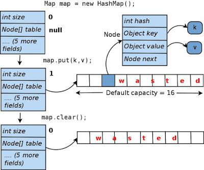

# 해시맵 (Hashmap) Java

## 개요
HashMap은 키-값 쌍으로 요소를 저장하는 기본 데이터 구조입니다. 각 키는 고유하며 특정 값과 연결됩니다. HashMap은 해시 함수가 요소를 버킷 사이에 적절하게 분산한다고 가정하면 get과 put과 같은 기본 작업에 대해 상수 시간 성능을 제공하므로 데이터를 저장하고 검색하는 효율적인 방법을 제공합니다.
## 기본 원칙

1. **선언 및 초기화:**
    - Java에서 HashMap은 다음과 같은 구문을 사용하여 선언하고 초기화할 수 있습니다.
      ```java
      HashMap<String, Integer> map = new HashMap<>();
      ```

2. **요소 접근:**
    - Hashmap의 요소는 키를 사용하여 액세스됩니다.
      ```java
      int value = map.get("key");
      ```

3. **Hashmap 크기:**
    - HashMap의 크기는 요소가 추가되거나 제거됨에 따라 동적으로 증가하거나 감소할 수 있습니다.

4. **고유한 키:**
    - HashMap의 각 키는 고유해야 합니다 요소를 삽입할 때 중복 키를 사용하면 새 값이 키와 연결된 기존 값을 덮어씁니다.



## 사용 사례

HashMap은 다양한 시나리오에서 사용됩니다.

- 빠른 조회: HashMap은 고유 식별자(키)를 기반으로 값을 빠르게 조회해야 하는 상황에 이상적입니다.  
- 캐시 구현: HashMap은 키를 캐시할 데이터로, 값을 캐시된 정보로 사용하여 캐시를 구현하는 데 사용할 수 있습니다.  
- 요소의 빈도 수 계산: HashMap은 요소를 키로, 카운트를 값으로 사용하여 컬렉션에서 요소의 빈도 수를 계산하는 데 사용할 수 있습니다.

## 효율성과 복잡성

1. **시간 복잡성:**
   - 키를 사용하여 요소에 액세스: O(1)
   - 요소 삽입 또는 삭제: O(1)
   - 특정 키 또는 값 검색: O(n)

2. **공간 복잡성:**
    - O(n) - HashMap은 각 고유 키-값 쌍에 대한 공간이 필요합니다

## 일반적인 HashMap 메서드

### 1. **size 메서드:**
- **설명:** 이 맵에 있는 키-값 매핑의 수를 반환합니다.
- **예시:**
  ```java
  int size = map.size();
  ```

### 2. **put 메서드:**
- **설명:** 이 맵에서 지정된 키와 연결된 지정된 값을 연결합니다.
- **예시:**
  ```java
  map.put("key", 1);
  ```

### 3. **get 메서드:**
- **설명:** 지정된 키가 매핑된 값을 반환하거나, 이 맵에 키에 대한 매핑이 없는 경우 null을 반환합니다.
- **예시:**
  ```java
  int value = map.get("key");
  ```

### 4. **remove 메서드:**
- **설명:** 이 맵에서 지정된 키의 매핑을 제거합니다(있는 경우).
- **예시:**
  ```java
  map.remove("key");
  ```

### 5. **containsKey 메서드:**
- **설명:** 이 맵이 지정된 키에 대한 매핑을 포함하고 있는 경우 true를 반환합니다.
- **예시:**
  ```java
  boolean exists = map.containsKey("key");
  ```

## 결론

HashMap은 다양한 응용 프로그램에서 사용되는 다양하고 효율적인 데이터 구조입니다. HashMap의 원칙과 일반적인 메서드를 이해하는 것은 효과적인 프로그래밍과 알고리즘 설계에 중요합니다. 응용 프로그램의 특정 요구 사항에 기반하여 HashMap 작업의 시간 및 공간 복잡성을 고려하여 합리적인 선택을 할 수 있도록 유의해야 합니다.