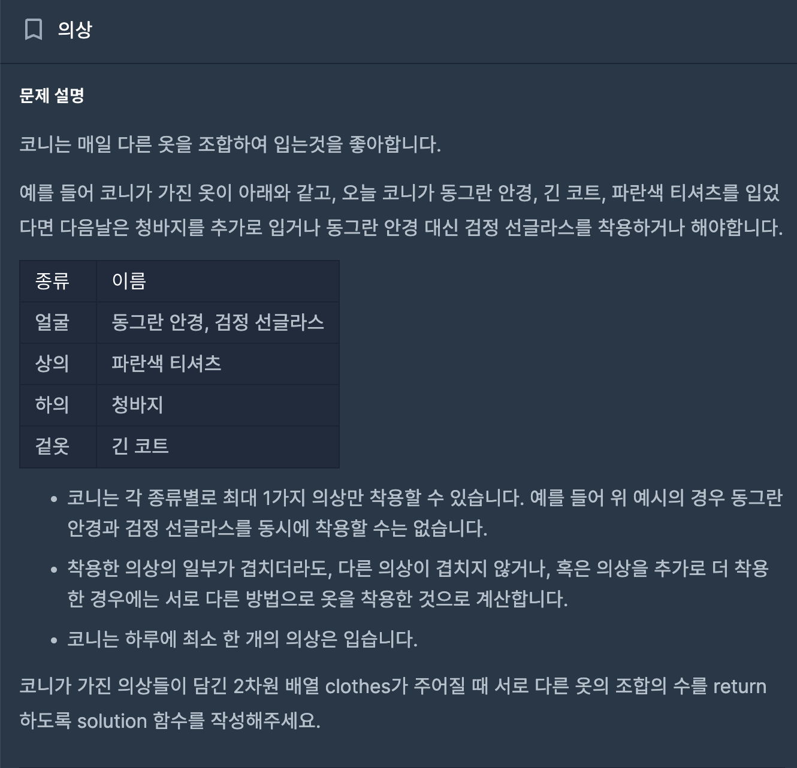
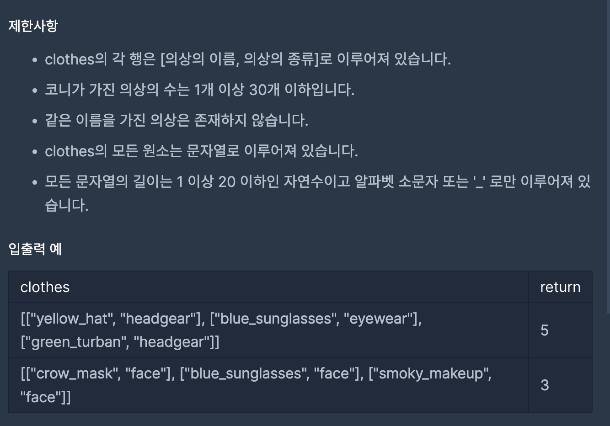
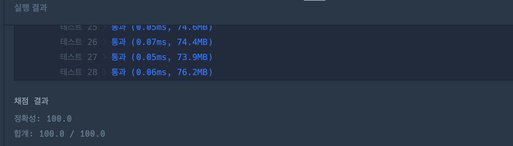

# 의상

---
## 프로그래머스

## 문제

https://school.programmers.co.kr/learn/courses/30/lessons/42578



## 제한 사항 및 입출력 예제



## 접근 방법

- 의상의 종류별로 몇 개의 의상이 있는지를 세는 것이 중요합니다. 주어진 의상 목록에서 각 의상의 종류를 기준으로 몇 개의 의상이 있는지를 파악하고, 이를 이용하여 서로 다른 조합의 수를 계산합니다.
- 각 의상의 종류별로 몇 개의 의상이 있는지를 세는 데에는 Map 자료구조를 활용합니다. 주어진 의상 목록을 순회하면서 각 의상의 종류를 키(key)로 하고, 해당 종류의 의상 개수를 값(value)으로 하는 맵을 만듭니다.
- 그 다음, 각 의상 종류에 대해 선택하지 않는 경우도 포함해서 모든 조합의 수를 계산합니다. 이를 위해 각 의상 종류별 의상 개수에 1을 더한 값을 곱하고, 마지막에 1을 빼서 아무 의상도 선택하지 않은 경우를 제외합니다.

---
## 구현

```java
public static int solution(String[][] clothes) {
        Map<String, Integer> clothesCountMap = new HashMap<>();

        for (String[] pair : clothes) {
        String clothingType = pair[1];
        clothesCountMap.put(clothingType, clothesCountMap.getOrDefault(clothingType, 0) + 1);
        }

        int answer = 1;

        for (int count : clothesCountMap.values()) {
        answer *= (count + 1);
        }

        return answer - 1;
        }
```

## 시간 복잡도

- 의상 목록을 순회하며 Map을 업데이트하는 부분은 O(N) 시간이 소요됩니다. 여기서 N은 의상의 개수입니다. 그 후에는 Map의 값들을 모두 곱하는 연산이 있으므로 O(M) 시간이 추가로 소요됩니다. 여기서 M은 서로 다른 의상 종류의 개수입니다.


- 따라서 총 시간 복잡도는 <b>O(N + M)</b> 입니다.

## 공간 복잡도

- Map에 저장되는 정보의 개수는 의상 종류의 개수에 비례하므로, 공간 복잡도는 <b>O(M)</b> 입니다.

## 코드 인증


