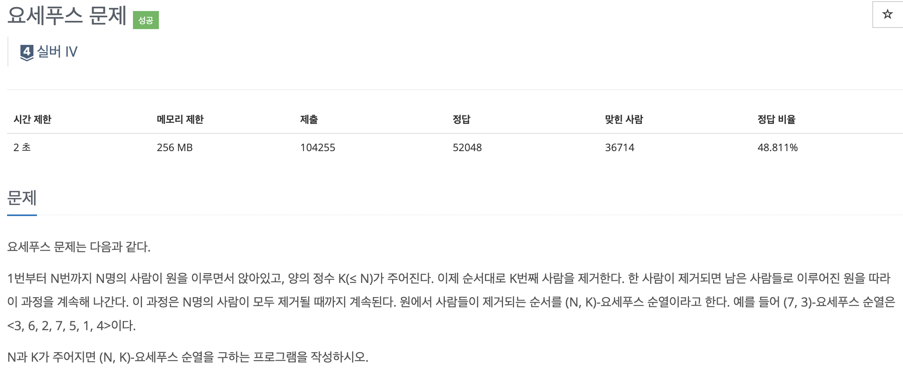
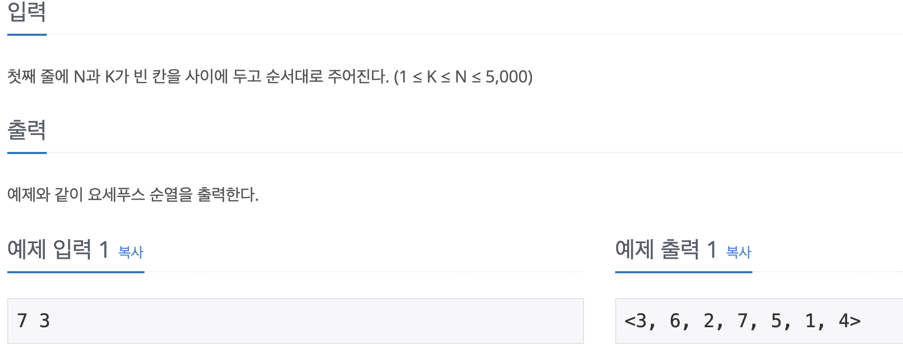
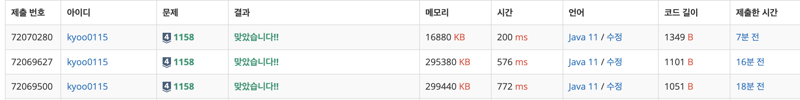

# 요세푸스 문제

---
## 백준 / BOJ

## 문제

https://www.acmicpc.net/problem/1158



## 제한 사항 및 입출력 예제



## 접근 방법
- 요세푸스 문제를 해결하기 위해 원형 연결 리스트를 사용합니다. 각 노드는 숫자 값을 가지며, 이 값은 사람의 번호를 나타냅니다.
- 원형 연결 리스트를 생성한 후, K번째 사람을 제거하는 연산을 반복합니다. 이때, 제거된 사람의 번호를 출력합니다.
- 모든 사람이 제거될 때까지 이 과정을 반복합니다.
---
## 구현

```java
package CodingTest.OnBoardingDay5.BOJ;

import java.io.BufferedReader;
import java.io.IOException;
import java.io.InputStreamReader;

class Node {
    int value;
    Node next;

    Node(int value) {
        this.value = value;
    }
}

public class Josephus {

    public static void main(String[] args) throws IOException {
        BufferedReader br = new BufferedReader(new InputStreamReader(System.in));
        String[] input = br.readLine().split(" ");
        int n = Integer.parseInt(input[0]);
        int k = Integer.parseInt(input[1]);
        josephus(n, k);
    }

    public static void josephus(int N, int K) {
        Node head = new Node(1);
        Node prev = head;

        for (int i = 2; i <= N; i++) {
            prev.next = new Node(i);
            prev = prev.next;
        }

        // Make the list circular
        prev.next = head;

        Node node = head;
        Node prevNode = prev;

        StringBuilder sb = new StringBuilder();
        sb.append("<");

        while (node != node.next) {
            for (int i = 1; i < K; i++) {
                prevNode = node;
                node = node.next;
            }

            sb.append(node.value);
            sb.append(", ");
            prevNode.next = node.next;
            node = node.next;
        }

        sb.append(node.value);
        sb.append(">");

        System.out.println(sb);
    }
}
```

## 시간 복잡도

원형 연결 리스트를 생성하는 데에는 <b>O(N)</b 시간이 소요됩니다. 여기서 N은 사람의 수입니다.  
그 후에는 K번째 사람을 제거하는 연산을 N번 반복하므로, 이 연산은 <b>O(NK)</b> 시간이 소요됩니다.

## 공간 복잡도

- 원형 연결 리스트에 저장되는 정보의 개수는 사람의 수에 비례하므로, 공간 복잡도는 <b>O(N)</b> 입니다.

## 코드 인증


