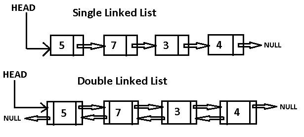

# 연결 리스트 (Linked List) Java

## 개요
연결 리스트는 노드의 집합으로, 각 노드가 데이터와 다음 노드에 대한 참조(링크)를 가지고 있는 선형 데이터 구조입니다. 
연결 리스트는 데이터를 저장하고 검색하는 효율적인 방법을 제공합니다.
## 기본 원칙


1. **노드 (Node):**

    - 연결 리스트의 기본 단위입니다. 각 노드는 두 부분으로 구성됩니다: 데이터 필드와 다음 노드를 가리키는 참조(링크).

2. **헤드 (Head):**
    - 연결 리스트의 첫 번째 노드를 가리킵니다. 연결 리스트의 모든 작업(삽입, 삭제, 검색 등)은 헤드를 통해 시작됩니다.

3. **다음 (Next):**
    - 각 노드는 다음 노드를 가리키는 참조를 가지고 있습니다. 이 참조를 통해 연결 리스트의 노드를 순회할 수 있습니다.
4. **널 (Null):**
    - 연결 리스트의 마지막 노드는 다음 노드를 가리키는 참조가 널(null)입니다. 이는 연결 리스트의 끝을 나타냅니다.
5. **이전 (Prev)** - 이중 연결 리스트 (Doubly Linked List)의 경우:
    - 각 노드는 이전 노드를 가리키는 참조를 가지고 있습니다. 이 참조를 통해 연결 리스트의 노드를 순회할 수 있습니다.

### 더블 링크드 리스트 (Doubly Linked List)


## 사용 사례

연결 리스트는 다양한 시나리오에서 사용됩니다.
- 동적 크기: 연결 리스트는 요소가 추가되거나 제거됨에 따라 크기가 동적으로 변경되므로, 크기가 미리 알려지지 않은 경우에 이상적입니다.
- 삽입 및 삭제: 연결 리스트는 요소의 삽입 및 삭제에 대해 상수 시간 성능을 제공하므로, 이러한 작업이 빈번하게 발생하는 경우에 유용합니다.

## 효율성과 복잡성

1. **시간 복잡성:**
   - 인덱스를 사용하여 요소에 액세스: O(n)
   - 요소 삽입 또는 삭제: O(1)
   - 특정 값 검색: O(n)

2. **공간 복잡성:**
    - O(n) - 연결 리스트는 각 노드에 대한 공간이 필요합니다

## 일반적인 연결 리스트 작업

### 1. **노드 생성:**
- **설명:** 새 노드를 생성하고 데이터를 저장합니다. 다음 노드를 가리키는 참조는 초기에 널로 설정됩니다.
- **예시:**
```java
class Node {
    int data;
    Node next;

    Node(int data) {
        this.data = data;
        this.next = null;
    }
}
  ```

### 2. **노드 삽입:**
- **설명:** 새 노드를 연결 리스트의 헤드로 삽입합니다. 새 노드의 다음 참조는 이전 헤드를 가리키고, 헤드는 새 노드를 가리킵니다.
- **예시:**
```java
Node newNode = new Node(1);
newNode.next = head;
head = newNode;
```

### 3. **노드 삭제:**
- **설명:** 연결 리스트에서 노드를 삭제합니다. 삭제할 노드의 이전 노드의 다음 참조를 삭제할 노드의 다음 노드를 가리키도록 변경합니다.
- **예시:**
```java
Node temp = head;
while (temp.next != null && temp.next.data != key) {
    temp = temp.next;
    }

    if (temp.next != null) {
    temp.next = temp.next.next;
    }
```

### 4. **노드 검색:**
- **설명:** 연결 리스트에서 특정 값을 가진 노드를 검색합니다. 헤드부터 시작하여 각 노드의 데이터를 확인하고 일치하는 노드를 반환합니다.
- **예시:**
```java
Node temp = head;

    while (temp != null) {
        if (temp.data == key) {
            return temp;
        }
        temp = temp.next;
    }
    return null;
```

## 결론

연결 리스트는 다양한 응용 프로그램에서 사용되는 유연하고 효율적인 데이터 구조입니다. 연결 리스트의 원칙과 일반적인 메서드를 이해하는 것은 효과적인 프로그래밍과 알고리즘 설계에 중요합니다. 응용 프로그램의 특정 요구 사항에 기반하여 연결 리스트 작업의 시간 및 공간 복잡성을 고려하여 합리적인 선택을 할 수 있도록 유의해야 합니다.