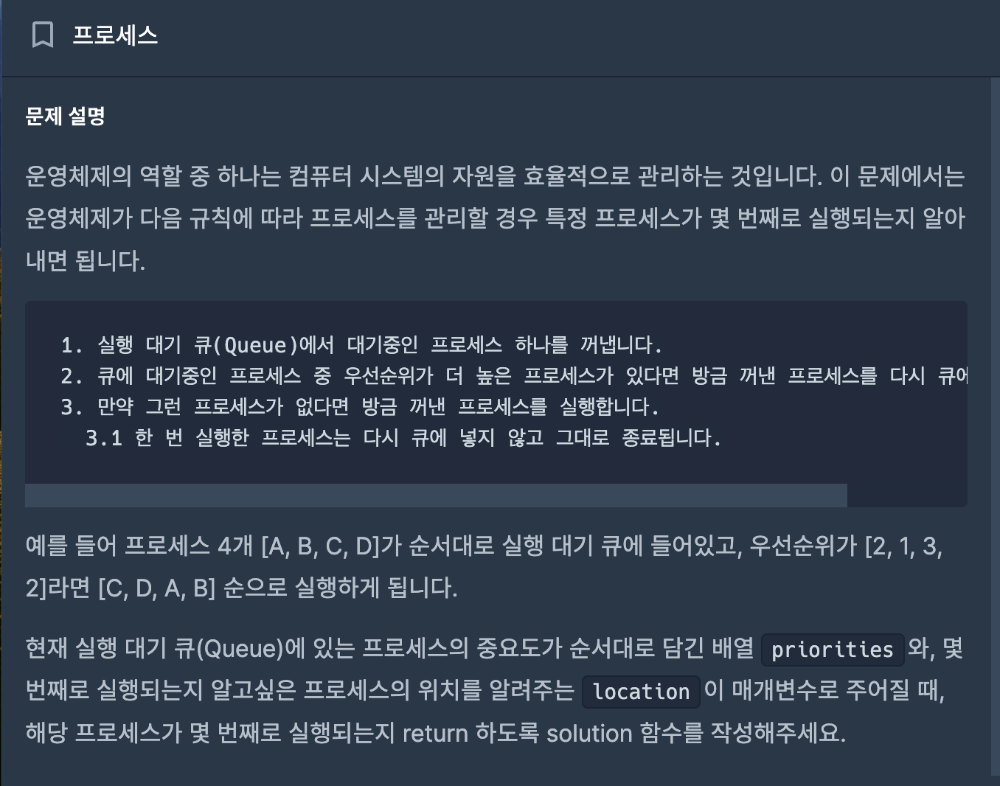
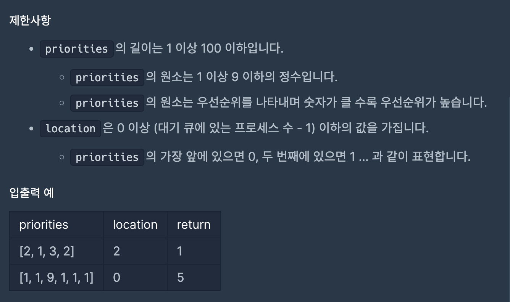
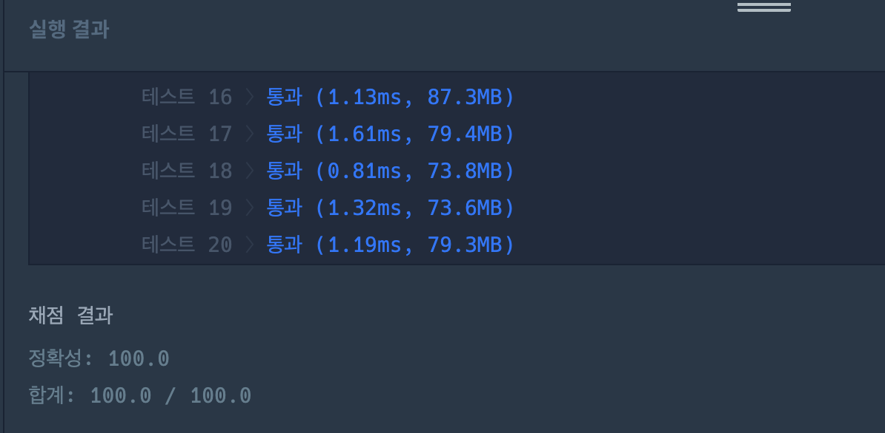

# 프로세스

---
## 프로그래머스

## 문제

hhttps://school.programmers.co.kr/learn/courses/30/lessons/42587



## 제한 사항 및 입출력 예제



## 접근 방법

- 문서의 우선순위와 위치를 바탕으로 문제를 해결합니다. 주어진 우선순위 배열에서 각 문서의 우선순위를 기준으로 몇 번째로 인쇄되는지를 파악하고, 이를 이용하여 문제를 해결합니다.
- 각 문서의 우선순위를 세는 데에는 Queue와 PriorityQueue 자료구조를 활용합니다. 주어진 우선순위 배열을 순회하면서 각 문서의 우선순위와 위치를 Pair로 묶어 Queue에 추가하고, 우선순위만 PriorityQueue에 추가합니다.
- 그 다음, Queue가 빌 때까지 반복하며 현재 문서의 우선순위가 PriorityQueue의 최대값과 같다면 인쇄하고, 그렇지 않다면 Queue의 맨 뒤로 보냅니다. 이를 통해 우선순위가 높은 문서부터 인쇄할 수 있습니다.

---
## 구현

```java
package CodingTest.OnBoardingDay5.Programmers;

import java.util.*;

class Pair {
    int priority;
    int index;

    public Pair(int priority, int index) {
        this.priority = priority;
        this.index = index;
    }
}

class Solution {

    public static int solution(int[] priorities, int location) {
        Queue<Pair> queue = new LinkedList<>();
        PriorityQueue<Integer> maxHeap = new PriorityQueue<>(Collections.reverseOrder());

        for (int i = 0; i < priorities.length; i++) {
            queue.offer(new Pair(priorities[i], i));
            maxHeap.offer(priorities[i]);
        }

        int count = 0;

        while (!queue.isEmpty()) {
            Pair current = queue.poll();
            if (current.priority == maxHeap.peek()) {
                maxHeap.poll();
                count++;
                if (current.index == location) {
                    break;
                }
            } else {
                queue.offer(current);
            }
        }

        return count;
    }
}
```

## 시간 복잡도

- 우선순위 배열을 순회하며 큐와 우선순위 큐를 업데이트하는 부분은 O(N) 시간이 소요됩니다. 여기서 N은 문서의 개수입니다. 그 후에는 큐가 빌 때까지 반복하며 문서를 인쇄하는 연산이 있으므로, 이 연산은 우선순위 큐의 offer (삽입) 및 poll (제거) 연산에 대해 O(log N) 시간이 소요됩니다.

- 따라서 총 시간 복잡도는 <b>O(N log N)</b> 입니다.

## 공간 복잡도

- Queue와 PriorityQueue에 저장되는 정보의 개수는 문서의 개수에 비례하므로, 공간 복잡도는 <b>O(N)</b> 입니다.

## 코드 인증


