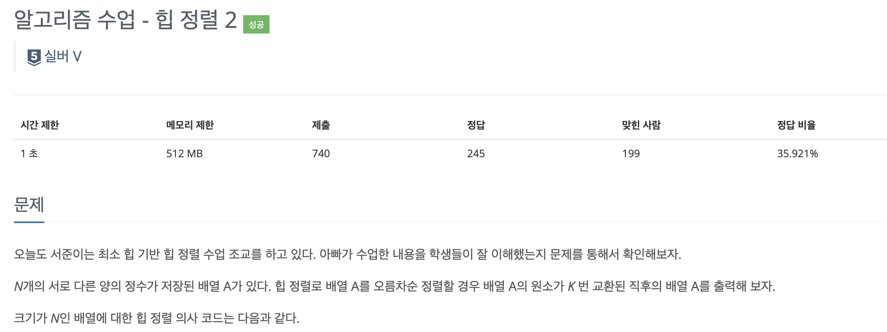
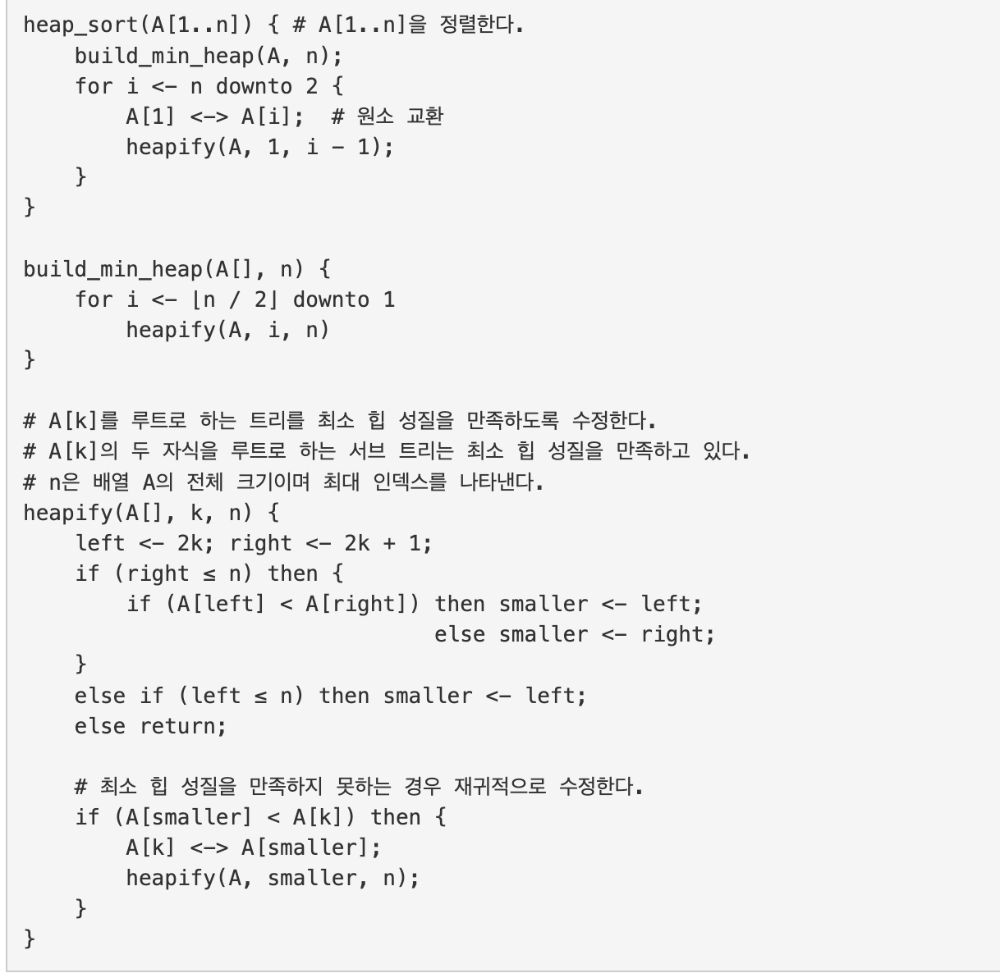
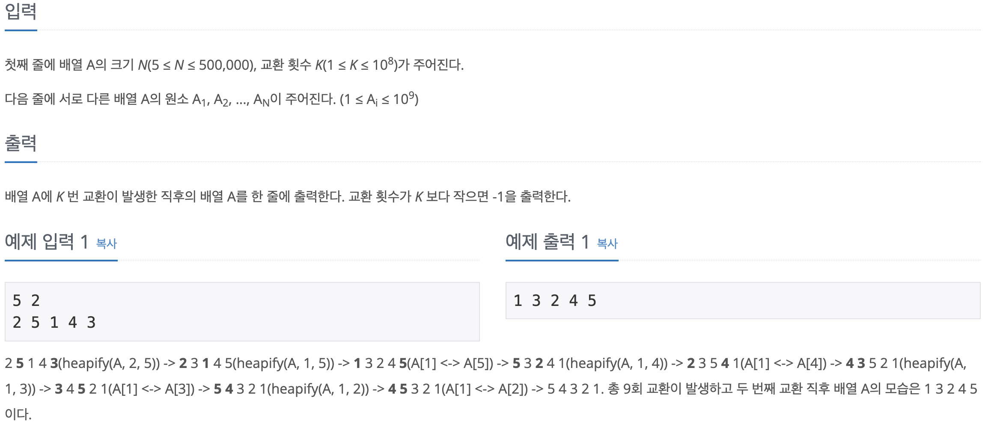
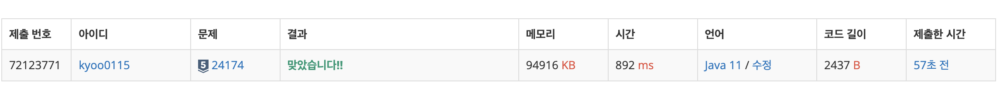

# 힙 정렬 2

---
## 백준 / BOJ

## 문제

https://www.acmicpc.net/problem/24174 [실버 4]




## 제한 사항 및 입출력 예제



## 접근 방법

- 힙 정렬 알고리즘을 사용하여 주어진 숫자 배열을 정렬합니다. 힙 정렬은 먼저 주어진 배열을 최소 힙으로 구성한 다음, 힙에서 가장 작은 요소를 반복적으로 제거하여 정렬된 배열을 생성하는 방식으로 작동합니다.
- 주어진 배열을 최소 힙으로 변환합니다. 이 과정에서 각 노드가 자식 노드보다 작거나 같은 값을 가지도록 배열의 요소를 재배치합니다.
- 힙에서 가장 작은 요소를 제거하고, 제거된 요소를 결과 배열에 추가합니다. 이 과정을 힙이 빌 때까지 반복합니다.
- K번째 스왑이 발생한 후의 배열 상태를 출력합니다. 만약 K번째 스왑이 발생하지 않았다면 "-1"을 출력합니다.

---
## 구현

```java
package CodingTest.OnBoardingDay6.BOJ;

import java.io.BufferedReader;
import java.io.IOException;
import java.io.InputStreamReader;
import java.util.StringTokenizer;

public class HeapSort2 {
    private static final StringBuilder result = new StringBuilder();
    private static int swapCount = 0;
    private static int targetSwapCount;
    private static boolean targetSwapCountReached = false;

    public static void main(String[] args) throws IOException {
        int[] numbers = readInput();
        heapSort(numbers);
        System.out.println(targetSwapCountReached ? result : "-1");
    }

    private static int[] readInput() throws IOException {
        BufferedReader reader = new BufferedReader(new InputStreamReader(System.in));
        String[] inputs = reader.readLine().split(" ");
        int num = Integer.parseInt(inputs[0]);
        targetSwapCount = Integer.parseInt(inputs[1]);
        int[] numbers = new int[num + 1];
        StringTokenizer tokenizer = new StringTokenizer(reader.readLine());
        for (int i = 1; i <= num; i++) {
            numbers[i] = Integer.parseInt(tokenizer.nextToken());
        }
        return numbers;
    }

    private static void heapSort(int[] numbers) {
        int n = numbers.length - 1;
        buildMinHeap(numbers, n);
        for (int i = n; i >= 2; i--) {
            swap(numbers, 1, i);
            heapify(numbers, 1, i - 1);
        }
    }

    private static void buildMinHeap(int[] numbers, int n) {
        for (int i = n / 2; i >= 1; i--) {
            heapify(numbers, i, n);
        }
    }

    private static void heapify(int[] numbers, int root, int n) {
        int left = 2 * root;
        int right = left + 1;
        int smallest;
        if (right <= n) {
            smallest = (numbers[left] < numbers[right]) ? left : right;
        } else if (left <= n) {
            smallest = left;
        } else {
            return;
        }
        if (numbers[smallest] < numbers[root]) {
            swap(numbers, root, smallest);
            heapify(numbers, smallest, n);
        }
    }

    private static void swap(int[] numbers, int i, int j) {
        swapCount++;
        int temp = numbers[i];
        numbers[i] = numbers[j];
        numbers[j] = temp;
        if (swapCount == targetSwapCount) {
            targetSwapCountReached = true;
            for (int k = 1; k < numbers.length; k++) {
                result.append(numbers[k]).append(" ");
            }
        }
    }
}
```

## 시간 복잡도

- 주어진 배열을 최소 힙으로 변환하는 데에는 <b>O(N)</b> 시간이 소요됩니다. 여기서 N은 숫자의 개수입니다.
- 그 후에는 힙에서 가장 작은 요소를 제거하는 연산을 N번 반복하므로, 이 연산은 <b>O(N log N)</b> 시간이 소요됩니다.

## 공간 복잡도

- 주어진 배열과 결과 배열에 저장되는 정보의 개수는 숫자의 개수에 비례하므로, 공간 복잡도는 <b>O(N)</b> 입니다.

## 코드 인증

