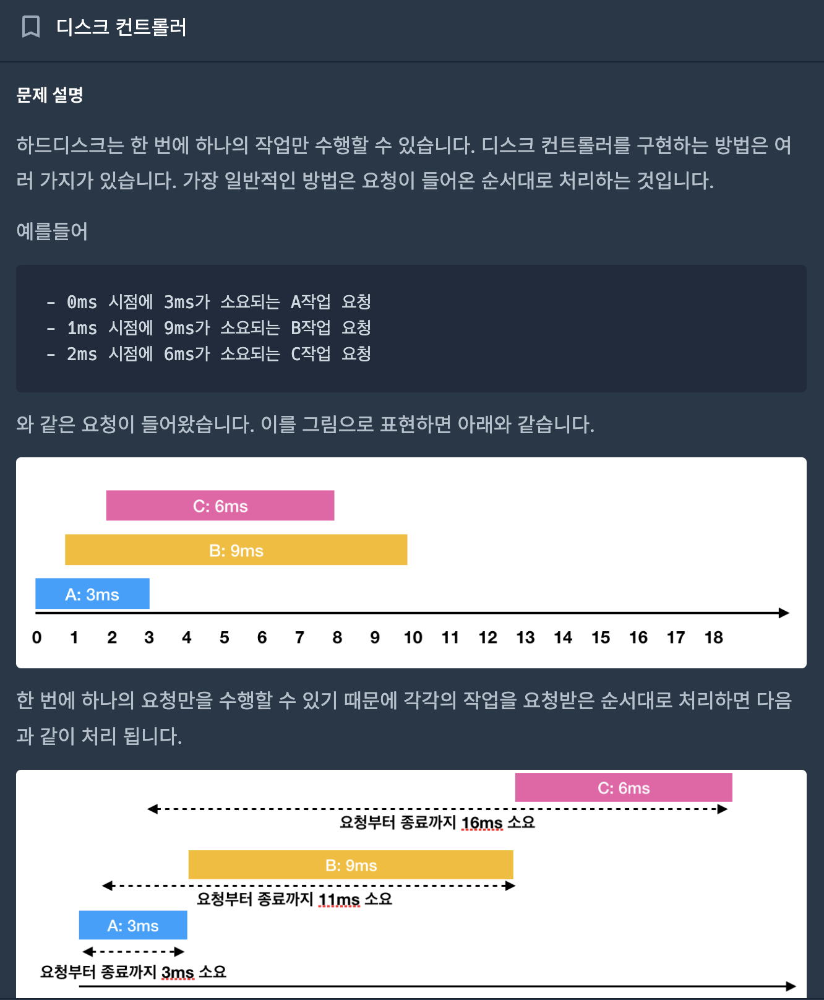
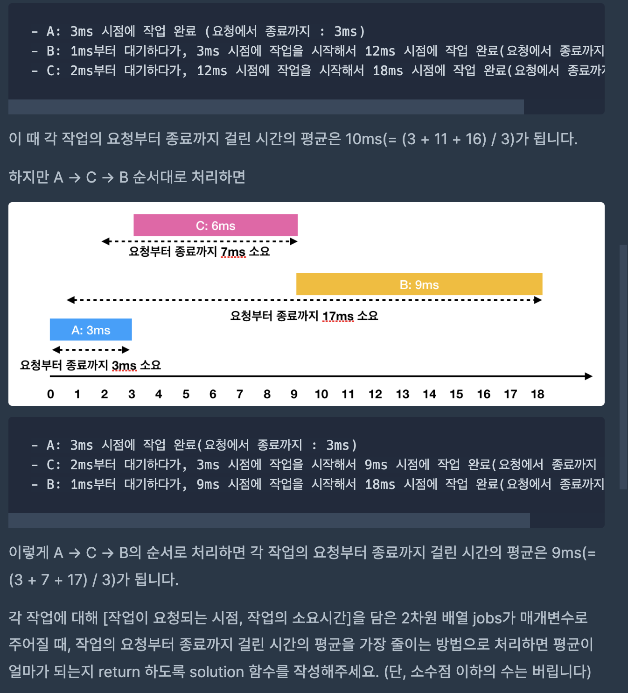
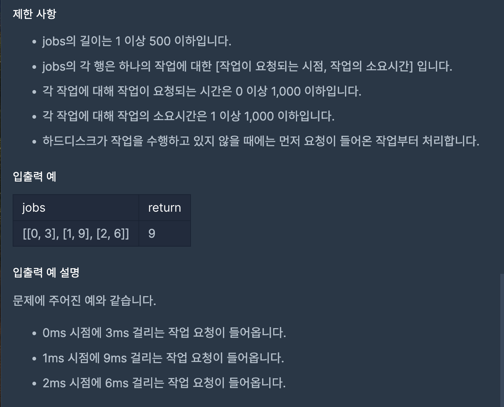
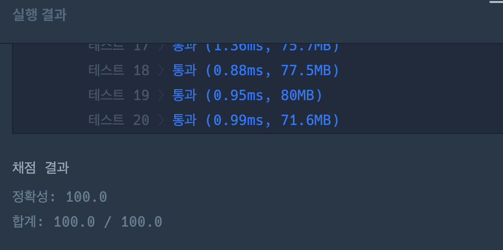

# 디스크 컨트롤러

---
## 프로그래머스

## 문제

https://school.programmers.co.kr/learn/courses/30/lessons/42627




## 제한 사항 및 입출력 예제



## 접근 방법

- 작업 요청 시간과 처리 시간을 바탕으로 문제를 해결합니다. 주어진 작업 배열에서 각 작업의 요청 시간과 처리 시간을 기준으로 어떤 작업을 먼저 처리할지를 결정하고, 이를 이용하여 문제를 해결합니다.
- 각 작업의 처리 시간을 세는 데에는 PriorityQueue 자료구조를 활용합니다. 주어진 작업 배열을 순회하면서 각 작업의 요청 시간과 처리 시간을 Job으로 묶어 PriorityQueue에 추가합니다.
- 그 다음, PriorityQueue가 빌 때까지 반복하며 현재 작업의 처리 시간이 PriorityQueue의 최소값과 같다면 처리하고, 그렇지 않다면 PriorityQueue의 맨 뒤로 보냅니다. 이를 통해 처리 시간이 짧은 작업부터 처리할 수 있습니다.

---
## 구현

```java
package CodingTest.OnBoardingDay6.Programmers;

import java.util.*;

public class DiskController {

    static class Job implements Comparable<Job> {
        int requestTime;
        int processingTime;

        public Job(int requestTime, int processingTime) {
            this.requestTime = requestTime;
            this.processingTime = processingTime;
        }

        @Override
        public int compareTo(Job other) {
            return this.processingTime - other.processingTime;
        }
    }

    public static int solution(int[][] jobs) {
        int answer = 0;
        int currentTime = 0;
        int jobIndex = 0;

        Arrays.sort(jobs, Comparator.comparingInt(a -> a[0]));
        PriorityQueue<Job> minHeap = new PriorityQueue<>();

        while (jobIndex < jobs.length || !minHeap.isEmpty()) {
            while (jobIndex < jobs.length && jobs[jobIndex][0] <= currentTime) {
                minHeap.offer(new Job(jobs[jobIndex][0], jobs[jobIndex][1]));
                jobIndex++;
            }

            if (!minHeap.isEmpty()) {
                Job currentJob = minHeap.poll();
                answer += currentTime - currentJob.requestTime + currentJob.processingTime;
                currentTime += currentJob.processingTime;
            } else {
                currentTime = jobs[jobIndex][0];
            }
        }

        return answer / jobs.length;
    }
}
```

## 시간 복잡도

- 작업 배열을 순회하며 PriorityQueue를 업데이트하는 부분은 O(N) 시간이 소요됩니다. 여기서 N은 작업의 개수입니다. 그 후에는 PriorityQueue가 빌 때까지 반복하며 작업을 처리하는 연산이 있으므로, 이 연산은 PriorityQueue의 offer (삽입) 및 poll (제거) 연산에 대해 O(log N) 시간이 소요됩니다.

- 따라서 총 시간 복잡도는 <b>O(N log N)</b> 입니다.

## 공간 복잡도

- PriorityQueue에 저장되는 정보의 개수는 작업의 개수에 비례하므로, 공간 복잡도는 <b>O(N)</b> 입니다.

## 코드 인증

